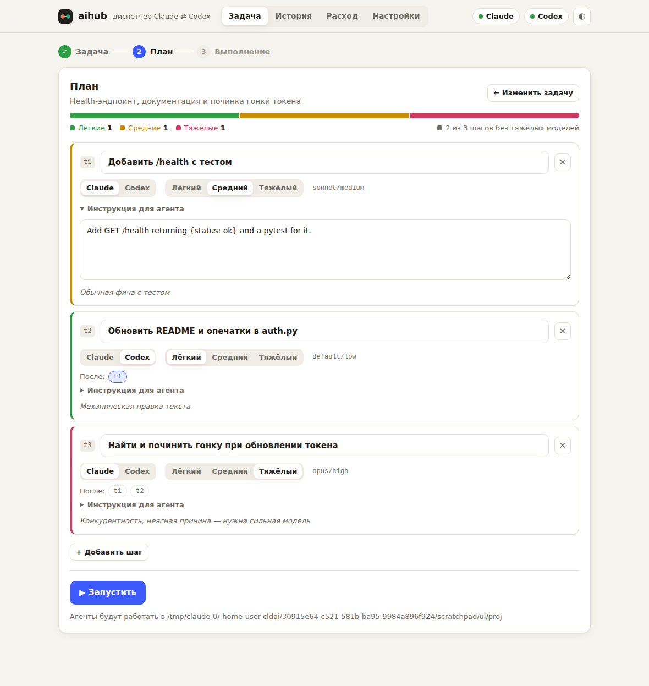
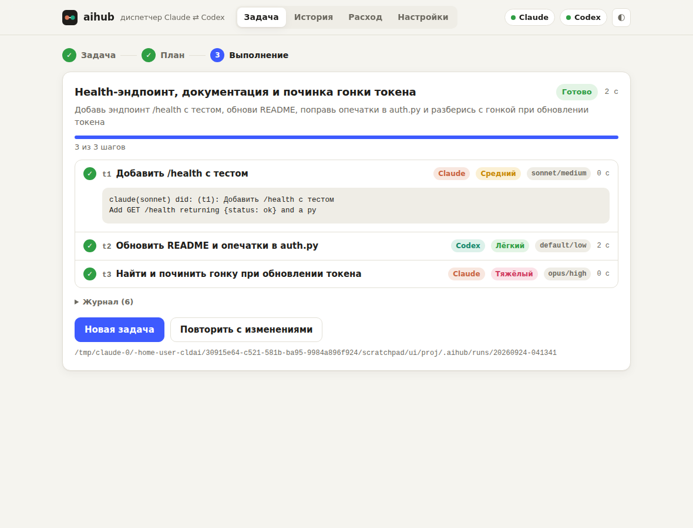
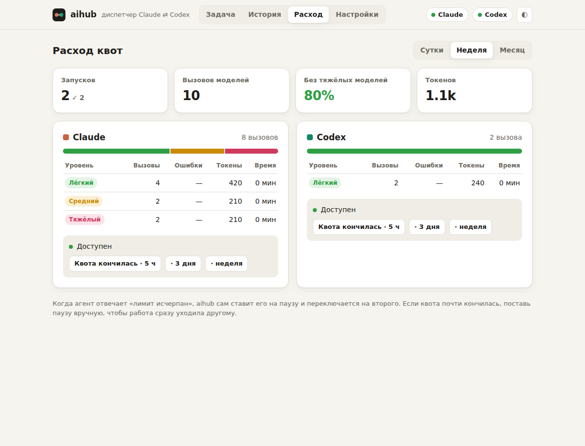

# aihub — диспетчер задач между Claude Code и Codex

Проблема: недельные квоты ChatGPT/Codex и Claude заканчиваются за 2–3 дня, потому что всё
подряд гоняется на тяжёлых моделях.

`aihub` работает так:

1. **Режет задачу на куски** и для каждого выбирает агента (`claude` / `codex`) и **самый дешёвый
   тир**, который справится: `light` / `medium` / `heavy`.
2. **Запускает куски** через `claude -p` и `codex exec` с нужной моделью, в правильном порядке, и
   передаёт отчёты предыдущих шагов следующим.
3. **Контролирует выполнение**: если агент упёрся в лимит, помечает его «выжатым» на N часов и
   перекидывает работу на другого; если дешёвая модель не справилась, повторяет на тир выше.
4. **Считает расход** по агентам и тирам (`aihub stats`) и показывает его планировщику, чтобы нагрузка
   распределялась между подписками.

Работает через твои подписки (залогиненные CLI), API-ключи не нужны. Есть приложение в браузере
и команды для терминала.

| тир    | Claude Code      | Codex                         | для чего |
|--------|------------------|-------------------------------|----------|
| light  | haiku, effort low | модель по умолчанию, reasoning low | переименования, доки, конфиги, мелкие правки, «найди где…» |
| medium | sonnet, medium   | reasoning medium              | обычная фича/багфикс, тесты, ревью |
| heavy  | opus, high       | reasoning high                | архитектура, мутный дебаг, гонки, безопасность |

Всё меняется в конфиге.

## Приложение (для всех)



| Выполнение | Расход квот |
|---|---|
|  |  |

Нужно один раз:
1. Установить [Python 3.11+](https://www.python.org/downloads/) (на Windows при установке включи
   галочку «Add Python to PATH»).
2. Установить и залогинить агентов, какие есть: [Claude Code](https://claude.com/claude-code)
   (`claude`) и/или [Codex CLI](https://github.com/openai/codex) (`codex`). Достаточно одного раза
   зайти в каждый и войти в свой аккаунт.
3. Скачать эту папку (Code → Download ZIP) и распаковать.

Дальше запускаешь двойным щелчком:
- Windows — `Запустить aihub (Windows).bat`
- macOS — `Запустить aihub (macOS).command` (в первый раз: правый щелчок → «Открыть»)
- Linux — `Запустить aihub (Linux).sh`

Откроется браузер с приложением:
- **Задача.** Пишешь задачу, указываешь папку проекта и выбираешь, кто разобьёт её на шаги:
  ChatGPT (бесплатно: копируешь промпт в чат и вставляешь ответ), Claude Haiku или Codex.
  Потом смотришь план: у каждого шага можно поменять агента, уровень модели, порядок и текст.
  Жмёшь «Запустить» и следишь за прогрессом по шагам; в любой момент можно остановить.
- **История.** Прошлые запуски с отчётом каждого шага; любой план можно открыть снова.
- **Расход.** Сколько вызовов и токенов ушло на каждого агента и уровень, какая доля без тяжёлых
  моделей. Там же кнопка «Квота кончилась», чтобы на время отправлять всё второму агенту.
- **Настройки.** Модели по уровням, права агентов, планировщик по умолчанию и проверка, что агенты
  установлены.

Приложение работает только на твоём компьютере (`127.0.0.1`), в интернет ничего не открывает.
Из терминала оно запускается командой `aihub ui` (или `python -m aihub ui` без установки).

## Установка (для терминала)

Нужны Python 3.11+ и залогиненные `claude` и/или `codex`.

```bash
git clone <этот репозиторий> && cd cldai
pip install -e .          # или: pipx install .
aihub init                # создаст ~/.aihub/config.toml
aihub doctor              # проверит, что claude/codex находятся
```

## Кто планирует (режет задачу)

Настраивается в `[planner] backend`:

- **`manual`** (по умолчанию) — ровно твоя идея: aihub печатает готовый промпт (и копирует его в буфер
  обмена), ты вставляешь его в **обычный чат ChatGPT** в приложении или на сайте, а JSON-ответ
  вставляешь обратно в терминал. Квоты Codex/Claude Code на планирование не тратятся.
- **`claude`** — автоматически через `claude -p` на haiku в облегчённом режиме: без инструментов, без
  CLAUDE.md и без системного промпта Claude Code. Проверено: план стоит ~1.5k входных токенов, а
  обычный вызов Claude Code — ~30k.
- **`codex`** — автоматически через `codex exec` на лёгком тире в read-only песочнице.
- **`heuristic`** — без LLM: одна подзадача, тир по ключевым словам.

У официального приложения ChatGPT нет API для управления чатом из программы, поэтому полностью
автоматический вариант — `claude` или `codex`, а бесплатный — `manual`. Если планировщик вернул
ерунду, aihub откатится на эвристику (`fallback_to_heuristic`).

## Использование

```bash
# полный цикл: план → подтверждение → выполнение
aihub run "добавь /health эндпоинт с тестом, обнови README, почини гонку при обновлении токена"

# задача из файла, планировщик claude, без подтверждения
aihub run -f task.md --planner claude -y

# мелочь без планирования: один шаг, тир по эвристике
aihub run --no-plan "поправь опечатки в README"

# только посмотреть план
aihub run --dry-run "..."

# сохранить план, поправить руками (агент/тир/промпт), потом выполнить
aihub plan -o plan.json "..."
aihub exec plan.json

# только один агент (например, у Claude кончилась неделя)
aihub run --only codex "..."

# расход за неделю и кто сейчас «выжат»
aihub stats
aihub stats --days 1

# вручную пометить, что квота кончилась / снять пометку
aihub cooldown claude --hours 48
aihub cooldown --clear
```

При подтверждении плана можно нажать `e`: план откроется в `$EDITOR`, там можно поменять агента,
тир или текст любого шага.

Каждый запуск пишет в `<проект>/.aihub/runs/<время>/` файлы `plan.json`, `<id>.md` с промптом и
ответом каждого шага и итоговый `summary.md`. Общая статистика и cooldown лежат в `~/.aihub/`
(переопределяется через `AIHUB_HOME`).

## Конфиг

`~/.aihub/config.toml` или `aihub.toml` в корне проекта (он важнее). Указывать нужно только то, что
меняешь, остальное берётся из [`aihub/default_config.toml`](aihub/default_config.toml).

```toml
[planner]
backend = "claude"

[routing]
prefer = "codex"        # чаще отдавать работу Codex (balanced | claude | codex)

[execution]
parallel = 2            # независимые шаги параллельно (осторожно: могут править одни файлы)

[agents.claude]
permission_mode = "acceptEdits"
allowed_tools = ["Bash(npm test:*)", "Bash(git diff:*)"]

[agents.codex.tiers.light]
model = "<лёгкая модель со своего тарифа>"   # посмотри в codex: /model
effort = "low"
```

У Codex по умолчанию модель не задана (берётся из `~/.codex/config.toml`), а экономия идёт за счёт
`model_reasoning_effort`. Если впишешь в тиры реальные лёгкую и тяжёлую модели своего тарифа,
сэкономишь ещё больше.

## Права агентов

- Claude по умолчанию запускается с `--permission-mode acceptEdits`: файлы правит сам, а shell-команды
  вне `allowed_tools` в неинтерактивном режиме отклоняются.
- Codex по умолчанию работает в песочнице `workspace-write`.
- Полная автономия: `permission_mode = "bypassPermissions"` / `sandbox = "danger-full-access"`, но
  только в проекте под git, где всё легко откатить.

## Тесты

```bash
python -m unittest discover -s tests
```

Тесты используют поддельные `claude`/`codex` (`tests/fakes/`) и квоты не тратят.
